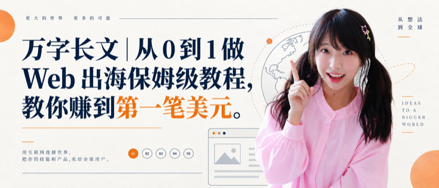

# 夏林果真人 IP 封面设计 Skill

这是一套给夏林果 AI 博主使用的封面模板系统。它适合制作推特长文、公众号文章、知识型长文和 Web 出海教程封面。

默认封面比例为 **21:9**，适合推特长文、公众号文章头图和横版文章封面。如果发布平台或内容需要，也可以调整为 3:2、4:3、1:1、9:16 等比例；只要在指令中说明目标比例即可。

## 调用后会发生什么

调用 `xialingguo-ip` 后，不需要你先研究说明书。Skill 会先展示一份简短的必要信息清单，让你一次看懂需要准备什么；你可以一次性回答，也可以只回答已经确定的部分，Skill 会再针对缺失项做少量补充确认，收齐后再生成封面。

第一次调用时可以只说：

> 调用 xialingguo-ip，帮我做一张文章封面。

随后它会优先确认 4 项：文章标题/主题、视觉风格、本次视觉重点、真人 IP姿势。比例、截图、Logo、数据图和文字排版属于可选补充，默认使用 21:9，不会因为暂时没有这些信息而卡住。

## 你能用它做什么

你只需要告诉我：

1. 想用哪一种风格；
2. 文章标题是什么；
3. 这次最想突出什么。

我会自动安排真人 IP、标题、产品界面、流程、结果和装饰元素的主次关系，并生成 21:9 横版封面。

## 九种风格速查

| 标识 | 风格 | 适合突出 |
| --- | --- | --- |
| 🟠⭐ | 暖色手绘教程风 | 小白教程、方法论、亲和力 |
| 🟢💻 | 产品主视觉风 | 网站、UI、工具和产品 |
| 🔵⚡ | 深色科技爆发风 | AI 趋势、增长、强冲击 |
| 🟡🟦 | 撕纸拼贴风 | 案例、故事、经验、创意 |
| ⚪🟠 | 编辑杂志风 | 长文、分析、知识整理 |
| 🟡⚫ | 黑金步骤爆款风 | 从 0 到 1、收益、强结果 |
| 🟢⚫ | 高饱和实测冲击风 | 实测、录屏、验证、挑战 |
| 🟡🟥 | 手写结果承诺风 | 入门、收益、行动指南 |
| 🟩🌐 | 产品后台沉浸风 | 工作流、数据、业务闭环 |

完整说明和样图见 [references/style-library.md](references/style-library.md)。

## 九种风格样图

下面的样图全部是已经生成过的成品，仅用于选择风格，不要求复刻样图中的标题、人物位置或具体内容。

<table>
  <tr>
    <td width="50%"><strong>🟠⭐ 暖色手绘教程风</strong> </td>
    <td width="50%"><strong>🟢💻 产品主视觉风</strong> </td>
  </tr>
  <tr>
    <td><strong>🔵⚡ 深色科技爆发风</strong> </td>
    <td><strong>🟡🟦 撕纸拼贴风</strong> </td>
  </tr>
  <tr>
    <td><strong>⚪🟠 编辑杂志风</strong> </td>
    <td><strong>🟡⚫ 黑金步骤爆款风</strong> </td>
  </tr>
  <tr>
    <td><strong>🟢⚫ 高饱和实测冲击风</strong> </td>
    <td><strong>🟡🟥 手写结果承诺风</strong> </td>
  </tr>
  <tr>
    <td><strong>🟩🌐 产品后台沉浸风</strong> </td>
    <td></td>
  </tr>
</table>

## 也可以一次性提供信息

如果你不想逐题回答，也可以一次性提供下面这些信息；Skill 仍会先复述确认，再生图：

> 用【🟠⭐ 暖色手绘教程风】做一张 21:9 文章封面。标题是【你的完整标题】。这次重点突出【标题 / 真人 IP / 产品界面 / 五步流程 / 第一笔收入 / 故事场景】。使用我的【举食指版 / 打招呼版 / AI 讲解版】真人 IP，保持脸、表情和动作不变。

## 想做得更准确，需要准备什么

### 必备信息

- 完整文章标题；
- 文章大致主题；
- 想使用的风格标识；
- 本次视觉重点；
- 真人 IP 图片，最好是正面、清晰、光线稳定的照片。

### 可选信息

- 指定真人姿势：打招呼、AI 讲解、举食指；
- 产品截图、网站截图、Logo 或数据图；
- 指定颜色或希望避开的颜色；
- 是否必须保留全部标题文字；
- 是否接受图片生成后再进行文字排版。

## 真人 IP 怎么准备

为了保持人物一致，建议用户准备一套自己的真人 IP素材：

- 打招呼版：手掌打开，适合亲和、欢迎、入门主题；
- AI 讲解版：适合产品、工具、流程和展示主题；
- 举食指版：适合重点提醒、步骤、结论和强观点主题。

如果你要求“原图直接放入”，需要明确告诉我：

> 不改变面部表情和动作，不美化，不换衣服，不加滤镜，直接抠图或原样放入。

## 视觉重点怎么说

不需要描述复杂版式，只要说清楚想让读者先看到什么：

- “这次突出标题，人物做辅助。”
- “这次突出真人 IP，让她成为视觉中心。”
- “这次突出网站界面和五步流程。”
- “这次突出第一笔美元和全球用户。”
- “这次突出从 0 到 1 的故事感。”

风格决定颜色、字体、质感和装饰；视觉重点决定谁是主角。人物放左边还是右边，由内容自然决定。

## 一个完整示例

> 用【🟡⚫ 黑金步骤爆款风】做一张 21:9 文章封面。标题是【万字长文｜从 0 到 1 做 Web 出海保姆级教程，教你赚到第一笔美元】。这次突出【从 0 到 1 的步骤和第一笔美元】。使用【举食指版】真人 IP，保持脸、表情和动作不变。画面加入网站、全球地图、流量增长和美元元素。

## 常见问题

### 我没有产品截图怎么办？

可以用抽象但易懂的浏览器窗口、网站页面、世界地图、流量图和用户图标代替。只有在需要还原真实产品时，才必须提供截图。

### 标题很长怎么办？

可以保持标题完整，但让图片生成模型只负责视觉底稿，之后用 Canva、Figma 或其他排版工具重新输入标题。这样中文最准确。

### 我只说“做得科技一点”可以吗？

可以，但最好再补充“突出什么”。例如：“用 🔵⚡ 深色科技爆发风，突出全球用户和第一笔美元。”

### 需要每次重新解释真人 IP吗？

第一次使用时需要提供自己的真人 IP参考图，并说明每张图的姿势名称。之后只需要说“使用举食指版”或“使用 AI 讲解版”即可。这个公开仓库不包含任何特定用户的真人 IP，也不会写死某个人的本地图片路径。
